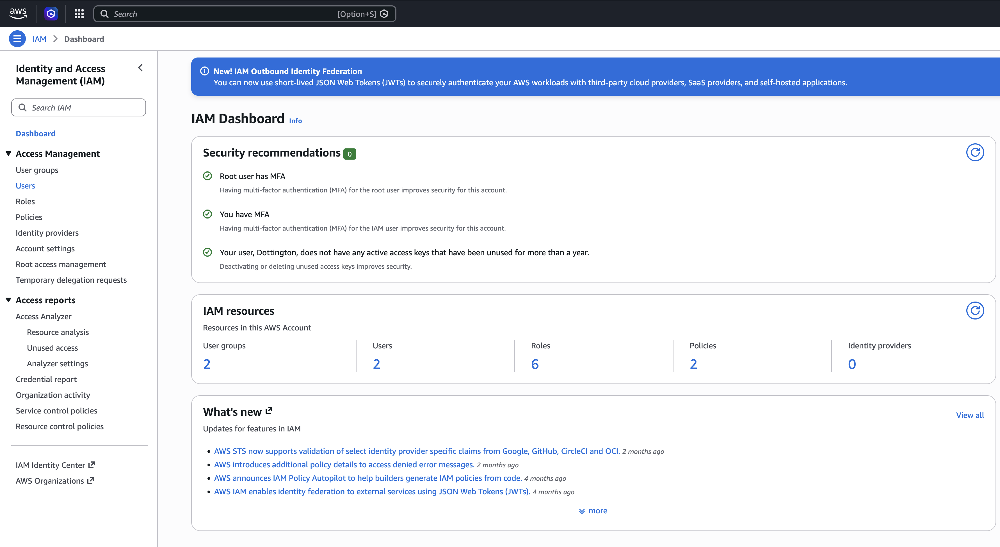
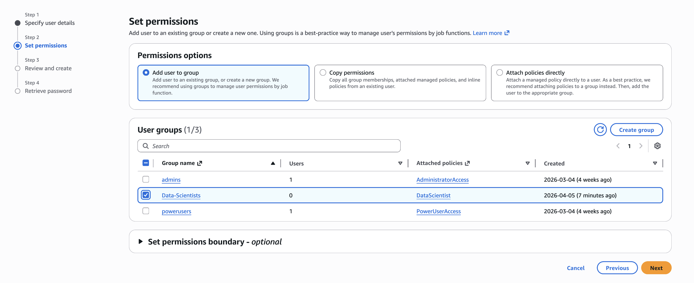
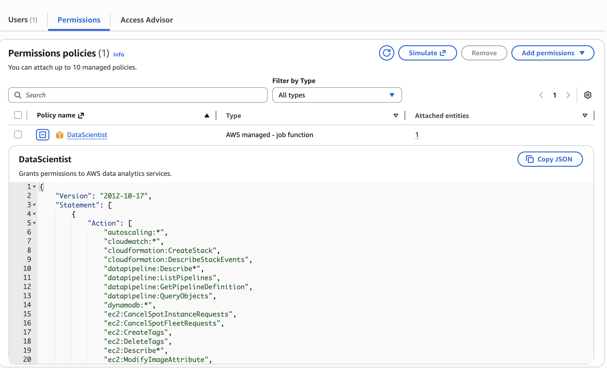

# Project 1: Designing Secure Access with AWS IAM

## Company Context

Sirhurryup Corporation is building its cloud foundation. Before deploying servers, applications, and storage, the organization must answer one critical question:

Who should have access to what?

This project focuses on designing a scalable Identity and Access Management (IAM) structure using groups, users, and policies to ensure that access is intentional, secure, and aligned with business responsibilities.

---

## Designing the Access Model

### Objective

Create a role-based access structure that reflects how permissions are managed in real environments.

### What I Built

* Created three IAM groups:

  * Admins
  * Data Scientists
  * Power Users
* Attached AWS managed policies to each group based on job responsibilities
* Created individual IAM users
* Assigned users to the appropriate groups
* Enabled AWS Management Console access with secure login credentials

---

## How IAM Works

IAM is built on two core principles:

**Authentication** answers the question: Who are you?

**Authorization** answers the question: What are you allowed to do?

Every AWS request must first be authenticated. Once identity is confirmed, IAM evaluates policies to determine whether access is allowed or denied.

Users can access AWS through:

* AWS Management Console
* AWS Command Line Interface (CLI)
* Application Programming Interfaces (APIs)

Temporary credentials can also be issued through AWS Security Token Service (STS).

---

## Key Concepts Applied

* **Users** represent individual identities
* **Groups** organize users with similar responsibilities
* **Policies** define permissions
* **Roles** provide temporary delegated access

IAM users have no permissions by default.

Rather than assigning permissions directly to each user, I attached policies to groups. Users inherit permissions based on group membership, which creates a cleaner and more scalable security model.

---

## Why This Matters

Managing permissions one user at a time does not scale.

Group-based access control allows organizations to define permissions once and apply them consistently. When responsibilities change, access can be updated in one place.

This approach reduces administrative overhead, improves consistency, and strengthens security.

---

## Architecture Overview

Requests may originate from the AWS Management Console, CLI, or APIs.

Each request passes through IAM for authentication and authorization. IAM evaluates the request against policies attached to users, groups, and roles. If permitted, the request is allowed to reach AWS services such as EC2, S3, or IAM itself.

---

## Screenshots

### IAM Dashboard

### IAM Groups

### User Creation and Group Assignment

### Policies Attached to Groups

---

## Lessons Learned

* IAM users have no permissions by default
* Group-based access control simplifies administration
* Policies are the foundation of authorization
* Authentication occurs before any AWS request is evaluated
* Access design directly impacts security and scalability

---

## What I Would Improve

* Replace broad managed policies with least-privilege permissions
* Use IAM roles more extensively for temporary access
* Integrate IAM activity with monitoring and auditing tools
* Reduce reliance on long-term credentials

---

## Why This Project Matters

This project changed how I think about access.

IAM is not simply about creating users. It is about designing a system where trust, responsibility, and permissions are structured intentionally.

In many ways, this is where cloud security begins.
