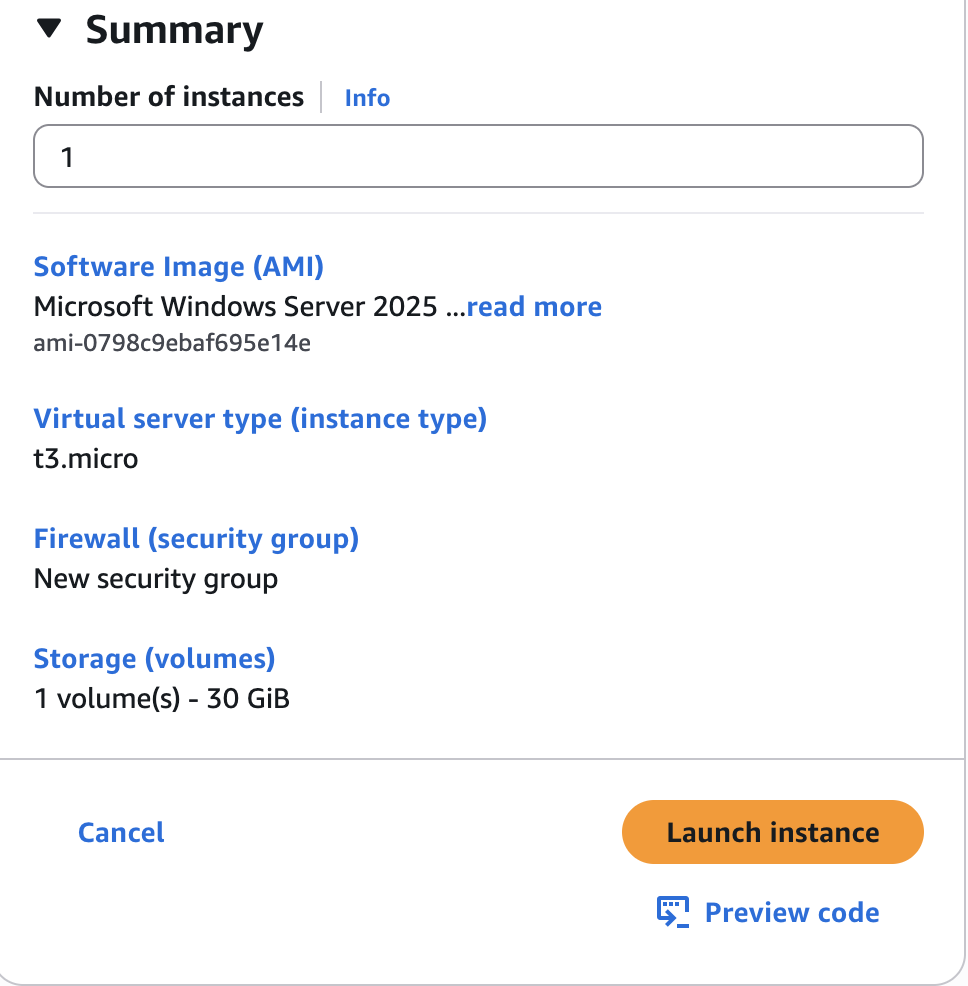
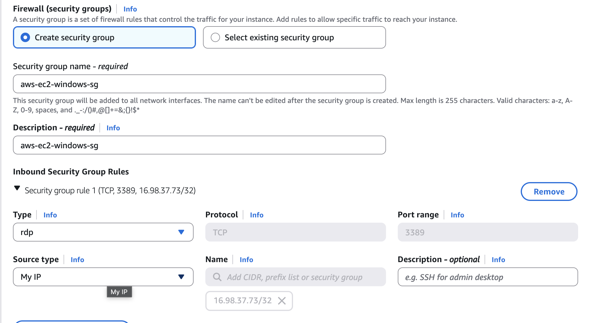
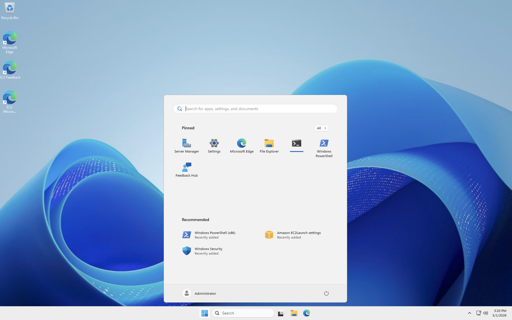

# Project 2: Secure Remote Access for Cloud Operations

## Company Context

Sirhurryup Corporation is expanding its cloud infrastructure across Linux and Windows environments. As the system grows, the IT team must maintain fast, reliable access to servers while minimizing security risks.

This project explores how remote access evolves from traditional methods like SSH and RDP to a more secure approach using AWS Systems Manager Session Manager.

---

## Part 1: Foundational (Linux EC2 + SSH)

### Objective
Establish secure administrative access to a Linux EC2 instance.

### What I Did


- Launched an Amazon Linux EC2 instance using AWS Free Tier
- Created and used a key pair for authentication
- Configured a Security Group to allow SSH (port 22)
- Restricted access to **my IP address** to reduce exposure

### SSH Group Configuration


```bash
chmod 400 "aws-ec2-proj2-keypair.pem"
ssh -i "aws-ec2-proj2-keypair.pem" ec2-user@<your-public-dns>
```

### SSH Access + Verification + Output 


### Why This Matters 
Access is the first layer of control in any system. By limiting SSH access to a specific IP, I reduced the attack surface while maintaining administrative control. 
---

## Part 2: Advanced (Windows EC2 + RDP)

### Objective
Establish secure remote desktop access to a Windows EC2 instance to support graphical administration and enterprise workloads.

### What I Did


- Launched a Windows EC2 instance
- Created a key pair to decrypt the administrator password
- Configured a Security Group to allow RDP (port 3389)
- Restricted access to **my IP address** to reduce exposure
- Retrieved the Windows administrator password using the key pair
- Connected to the instance using Remote Desktop Protocol (RDP)

---

### RDP Access


- Downloaded the RDP file from AWS
- Used the key pair to decrypt the administrator password
- Connected to the Windows instance using Remote Desktop

---

### Verification


- Successfully logged into the Windows desktop environment
- Confirmed full access to system interface and administrative tools

---

### Why This Matters

Not all systems are managed through the command line. Many enterprise environments rely on Windows-based infrastructure that requires graphical access.

By configuring RDP securely, I demonstrated the ability to manage a broader range of systems while maintaining control over access through IP restrictions and encrypted authentication.

---

## Part 3: Complex (SSM Session Manager)

### Objective
Eliminate direct SSH access by using AWS Systems Manager Session Manager to securely connect to EC2 instances without opening inbound ports.

---

### What I Did

- Launched a Linux EC2 instance
- Attached an IAM Role with Systems Manager permissions
- Connected to the instance using **Session Manager** from the AWS Console
- Created a file (`sirhurryup.txt`) using `vim` to validate system access
- Verified identity using `whoami`
- Switched user context from `ssm-user` to `ec2-user`
- Removed inbound SSH (port 22) from the Security Group to eliminate direct access

---

### SSM Access

- Used AWS Systems Manager → Session Manager to connect directly from the browser
- No SSH key or open port required
- Initial connection required proper IAM Role configuration

---

### Verification

```bash
whoami
```

### Initial Output:

```
ssm-user
```
### Switched User 
```
sudo su ec2-user
cd ~
ls
cat sirhurryup.txt
```

### Output 

- Confirmed access to home directory
- Verified file creation (```sirhurryup.txt```)
- Successfully accessed EC2 instance without SSH

### Key Observartions 

- Session Manager requires an IAM Role to function properly
- Connection delay can occure whil SSM initializes
- Default session user is ```ssm-user```, not ```ec2-user```
- SSH access can be fully removed without losing administrative control

### Why This Matters 
Traditional SSH access requires open ports, which increase the attack surface. By shifting to Session Manager, I eliminated inbound access requirements and moved to a model where access is controlled through IAM and audited through AWS. 

This approach aligns with modern cloud security practices by reducing exposure while maintaining full administrative capability. 
