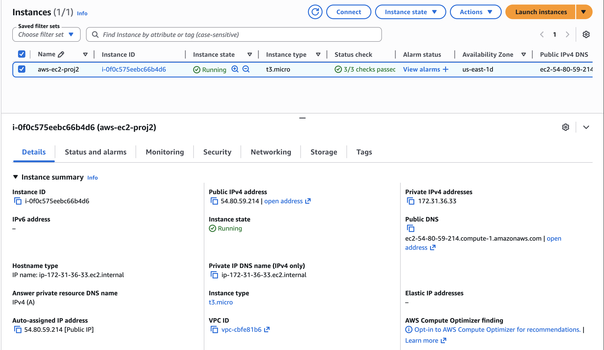
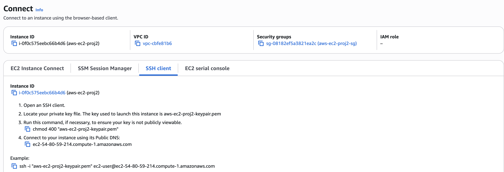
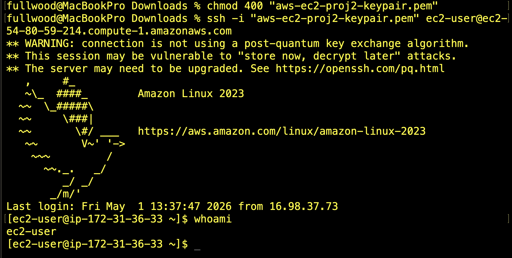

# Project 2: Secure Remote Access for Cloud Operations

## Company Context

Sirhurryup Corporation is expanding its cloud infrastructure across Linux and Windows environments. As the system grows, the IT team must maintain fast, reliable access to servers while minimizing security risks.

This project explores how remote access evolves from traditional methods like SSH and RDP to a more secure approach using AWS Systems Manager Session Manager.

---

## Part 1: Foundational (Linux EC2 + SSH)

### Objective
Establish secure administrative access to a Linux EC2 instance.

### What I Did


- Launched an Amazon Linux EC2 instance using AWS Free Tier
- Created and used a key pair for authentication
- Configured a Security Group to allow SSH (port 22)
- Restricted access to **my IP address** to reduce exposure

### SSH Group Configuration


```bash
chmod 400 "aws-ec2-proj2-keypair.pem"
ssh -i "aws-ec2-proj2-keypair.pem" ec2-user@<your-public-dns>
```

### SSH Access + Verification + Output 


### Why This Matters 
Access is the first layer of control in any system. By limiting SSH access to a specific IP, I reduced the attack surface while maintaining administrative control. 

### Objective
Establish secure remote desktop access to a Windows EC2 instance to support graphical administration and enterprise workloads.

### What I Did

- Launched a Windows EC2 instance
- Created a key pair to decrypt the administrator password
- Configured a Security Group to allow RDP (port 3389)
- Restricted access to **my IP address** to reduce exposure
- Retrieved the Windows administrator password using the key pair
- Connected to the instance using Remote Desktop Protocol (RDP)

---

### RDP Access

- Downloaded the RDP file from AWS
- Used the key pair to decrypt the administrator password
- Connected to the Windows instance using Remote Desktop

---

### Verification

- Successfully logged into the Windows desktop environment
- Confirmed full access to system interface and administrative tools

---

### Why This Matters

Not all systems are managed through the command line. Many enterprise environments rely on Windows-based infrastructure that requires graphical access.

By configuring RDP securely, I demonstrated the ability to manage a broader range of systems while maintaining control over access through IP restrictions and encrypted authentication.

---

## Part 3: Complex (SSM Session Manager)

### Objective 

Eliminate the need for direct SSM access by using AWS Systems Manager Session Manager Session for secure, browser-based instance access. 

## Why This Matters 

Reducing open ports and eliminating direct SSH access strengthens security posture and aligns with modern cloud best practices.
