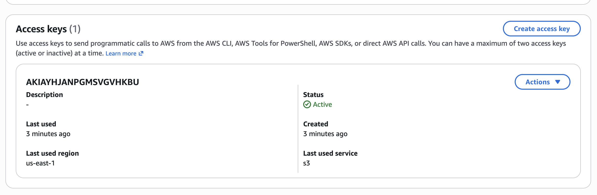
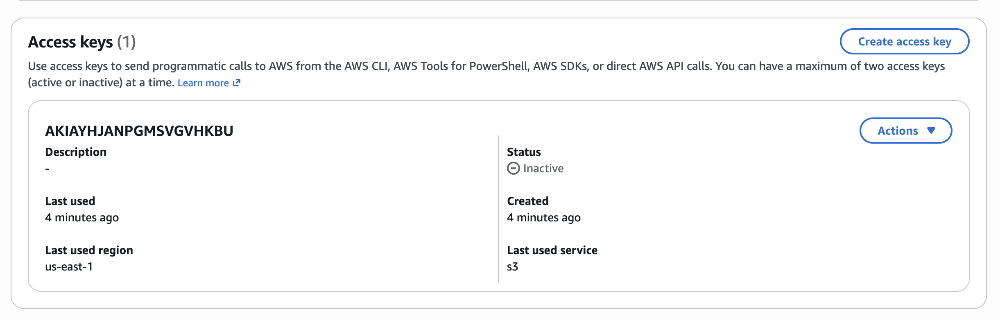
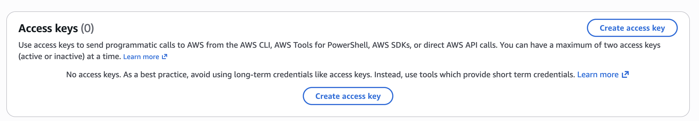
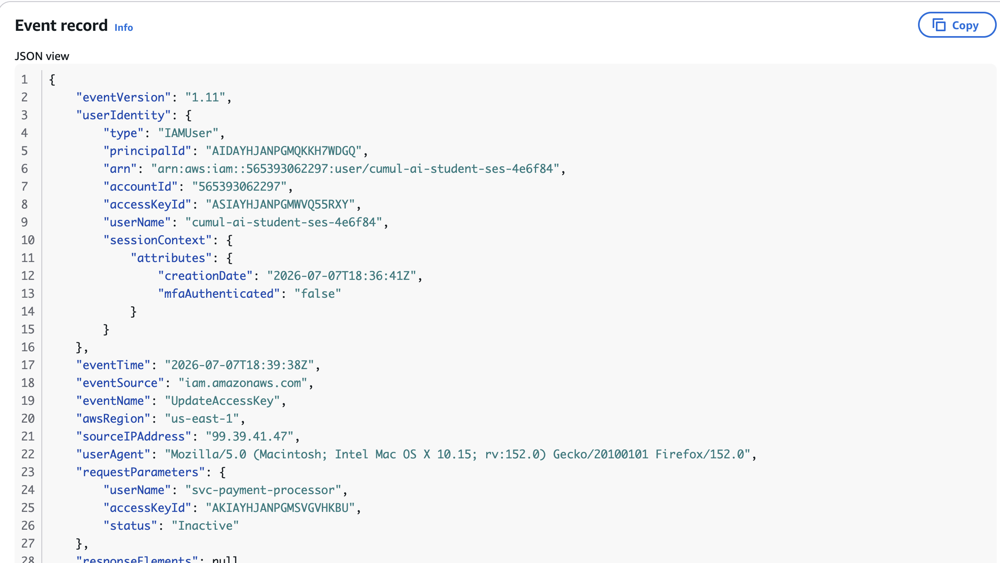
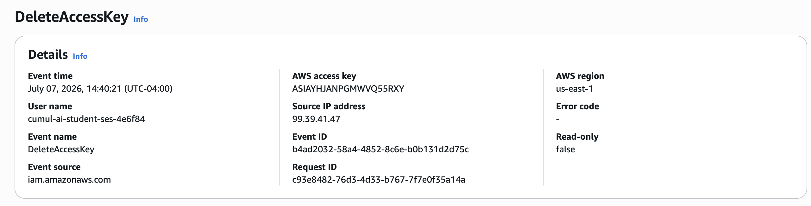

# Protecting Criticial Payment Infrastructure Through Rapid Credential Containment

> **Engagement:** 06
> **Client:** NorthBridge Financial
> **Industry:** Financial Services
> **Business Capability:** Credential Protection

## Business Problem

We provide cloud engineering and managed security services for organizations operating business-critical workloads on Amazon Web Services (AWS).

NorthBridge Financial, one of our managed financial services clients, relied on AWS to support its payment processing platform. During a routine security review, we identified that a service account credential used by a production payment application had been exposed in a public source code repository.

Because the credential authenticated directly to the client's AWS environment, the exposure represented an immediate business risk. An unauthorized actor could potentially access cloud resources, disrupt payment processing, or create unauthorized infrastructure capable of impacting financial operations and customer trust.

Our immediate objective was to contain the exposure, preserve evidence for forensic investigation, determine whether the credential had been used, and restore confidence in the client's cloud environment without disrupting payment services.

## Business Requirements

NorthBridge Financial engaged us to contain the exposed credential without disrupting payment operations. Because the credential supported a production workload, every decision had to balance security, operational continuity, and regulatory responsibility.

To meet the client's expectations, we established the following business requirements:

- Immediately eliminate the risk of unauthorized access.
- Preserve evidence to support a forensic investigation.
- Determine whether the exposed credential had been used.
- Maintain uninterrupted payment processing throughout the incident.
- Restore confidence in the AWS environment through verified containment and documented evidence.

## Business Risks

An exposed production credential represented a significant operational and security risk. If exploited, unauthorized access could compromise payment services, expose sensitive financial resources, interrupt business operations, and erode customer trust. Beyond the immediate technical impact, the organization also faced potential regulatory scrutiny, financial losses, and reputational damage.

Without rapid containment, the incident could have expanded from a single exposed credential into a broader compromise of the client's cloud environment.

## Proposed Solution

We implemented an incident response strategy focused on rapid containment, evidence preservation, and operational continuity. Rather than immediately removing resources, we secured the compromised credential, preserved investigative evidence, and verified the integrity of the client's AWS environment before completing remediation.

Our solution included the following actions:

- Disabled and permanently removed the compromised access key.
- Verified that no additional active access keys existed for the service account.
- Confirmed the service account could not authenticate through the AWS Management Console.
- Investigated AWS CloudTrail to establish the timeline of events and determine whether the credential had been used.
- Documented verified findings before closing the incident.

## Architecture Decisions

Every technical decision was driven by the objective of reducing business risk while preserving operational continuity.

Key architectural decisions included:

- Using AWS Identity and Access Management (IAM) to immediately disable and remove the compromised credential.
- Using AWS CloudTrail as the authoritative source to establish who performed each action, when the actions occurred, and whether the credential had been used.
- Preserving forensic evidence before completing remediation to support future investigations.
- Applying the principle of least privilege by ensuring the affected service account retained only the minimum access required for business operations.
- Separating containment, investigation, and recovery into distinct phases to reduce the likelihood of destroying valuable evidence.

## Implementation

We began by identifying the exposed service account and immediately disabling the compromised access key to prevent additional authentication attempts. After containment was confirmed, we permanently removed the credential and verified that no additional active access keys existed for the account.

Next, we confirmed that the service account did not have AWS Management Console access, reducing the attack surface to programmatic authentication only. We then reviewed AWS CloudTrail to reconstruct the incident timeline, identify the identity responsible for the credential activity, and verify whether the compromised credential had been used during the exposure window.

Throughout the engagement, every remediation step was validated before proceeding to the next phase to ensure the client's payment platform remained secure while preserving evidence for future analysis.

### Active IAM Access Key

The IAM user initially contained an active programmatic access key, confirming that the exposed credential existed before containment activities began.

### Access Key Disabled

Disabling the access key immediately prevented additional authentication attempts while preserving the credential for investigation.

### Access Key Deleted

Removing the compromised credential permanently eliminated its ability to authenticate and reduced the organization's attack surface.

### CloudTrail Investigation Timeline

AWS CloudTrail provided the authoritative audit trail needed to reconstruct the sequence of events, verify the affected identity, and determine when the credential was used during the investigation.

### Final Credential Verification

A final review confirmed that no active access keys remained for the affected service account, verifying that the compromised credential had been fully contained.

## Verification

We validated the success of the incident response by confirming the compromised access key was disabled and permanently removed from the affected service account. We also verified that no additional active access keys remained and confirmed the account could not authenticate through the AWS Management Console.

Using AWS CloudTrail, we reconstructed the sequence of events leading to the exposure and verified the identities involved in the incident. The environment was reviewed one final time to ensure the containment actions were successful and no unauthorized access paths remained.

## Business Impact

By rapidly containing the exposed credential and validating the integrity of the AWS environment, we reduced the risk of unauthorized access without disrupting payment processing operations. The incident response preserved business continuity, protected customer trust, and provided leadership with verified evidence to support operational and security decisions.

The engagement also strengthened the client's security posture by reinforcing credential management practices, improving incident response readiness, and demonstrating a repeatable process for responding to future cloud security events.

## Lessons Learned

This engagement reinforced that effective incident response begins with business priorities rather than technical actions. Rapid containment protected the client's payment platform while preserving the evidence needed for investigation.

Three key lessons emerged from this engagement:

1. Containment should always precede investigation when active credentials are exposed.
2. CloudTrail establishes what happened, who performed the action, and when it occurred, but additional operational evidence is required to determine why.
3. Security incidents should be measured by their business impact as much as their technical impact, ensuring every remediation decision protects both operations and customer trust.

4. ---

## Continue the Journey

This engagement is part of the **Designing Scalable Systems for Real People** portfolio, where SirhurryUp Corporation documents real-world cloud consulting engagements across security, infrastructure, automation, and scalable systems.

For the engineering narrative behind this engagement, read the accompanying Medium article.

Explore the remaining engagements to see how these principles evolve across AWS, Linux, Docker, Terraform, Kubernetes, Automation, and AI.

