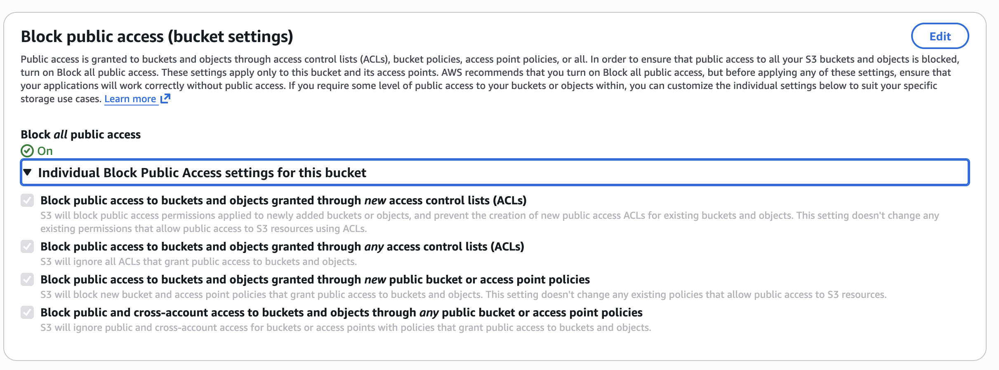
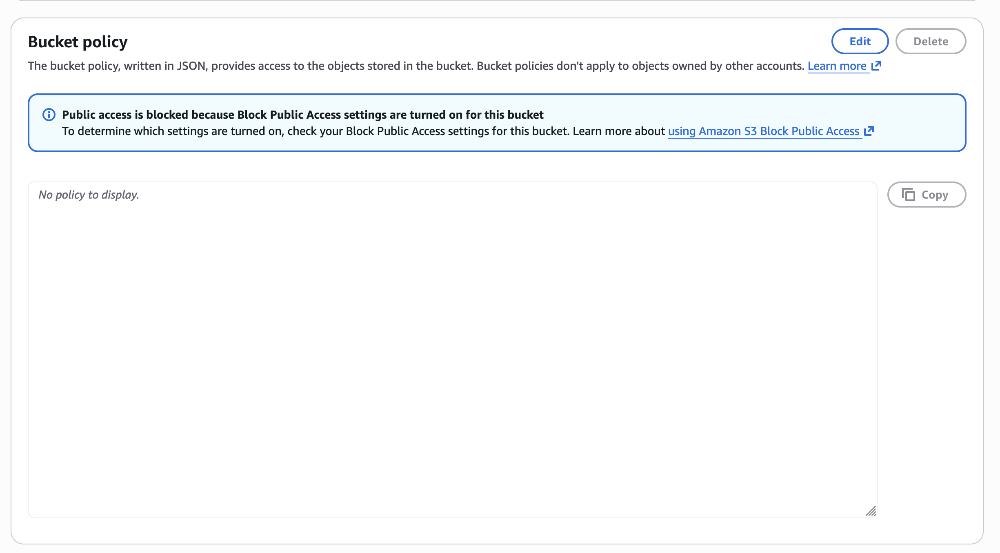
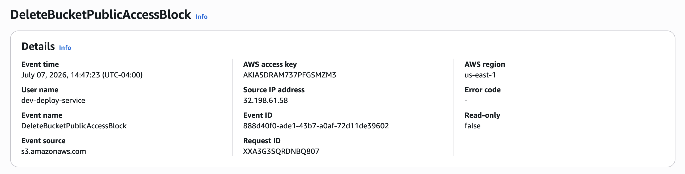
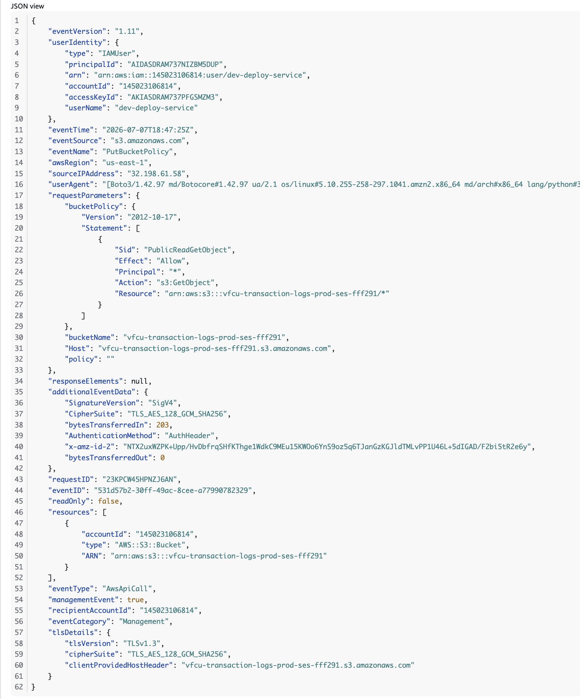
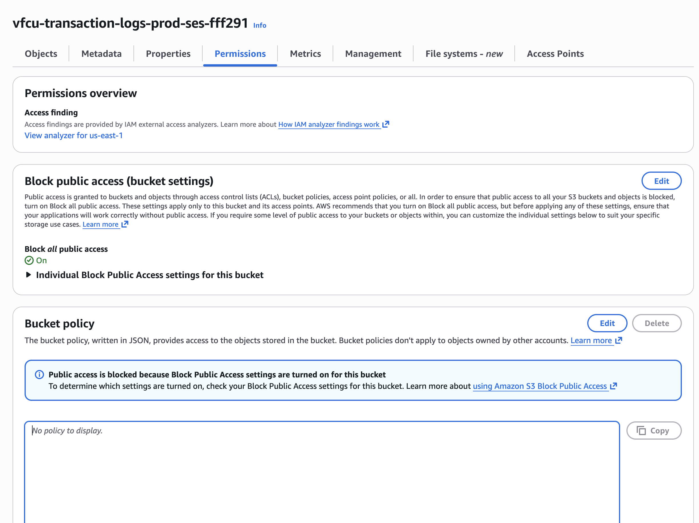

# Responding to a Public Exposure of Sensitive Financial Records Through Rapid S3 Containment

> **Engagement:** 07
> **Client:** NorthBridge Financial
> **Industry:** Financial Services
> **Business Capability:** Credential Protection

## Business Problem

We provide cloud engineering and managed security services for organizations operating business-critical workloads on Amazon Web Services (AWS).

NorthBridge Financial relied on Amazon S3 to store production transaction records containing sensitive customer information. During a routine security assessment, we discovered that a production storage bucket had been configured for public access, creating the potential for unauthorized access to financial records.

The exposure presented an immediate business risk. Unauthorized access to customer transaction data could have resulted in regulatory consequences, reputational damage, financial loss, and a loss of customer confidence.

Our immediate objective was to contain the exposure without disrupting business operations, preserve evidence for investigation, determine the duration of the exposure, and verify whether unauthorized access had occurred.

## Business Requirements

NorthBridge Financial required immediate containment of the public exposure while preserving the bucket contents for investigation. Because the bucket contained sensitive transaction records, the response had to prioritize data protection, evidence preservation, and operational continuity.

The engagement required us to:

- Enable full Block Public Access protection.
- Remove any public bucket policy granting access to external users.
- Preserve all stored records for forensic review.
- Use CloudTrail to determine who changed the bucket configuration.
- Establish the exposure window and verify whether anonymous access occurred.
- Confirm the bucket no longer appeared publicly accessible.

## Business Risks

A publicly accessible storage bucket containing customer transaction records represented a significant security and compliance risk. Unauthorized disclosure of sensitive financial data could have resulted in regulatory penalties, financial loss, reputational damage, and diminished customer trust.

Beyond the immediate exposure, the organization also faced uncertainty regarding the duration of the incident and whether external parties had accessed the data. Establishing an accurate timeline and preserving evidence became essential to supporting the investigation and meeting regulatory obligations.

## Proposed Solution

We implemented a containment strategy that immediately eliminated public access while preserving the integrity of the client's data for forensic investigation. Rather than deleting resources or modifying stored objects, we focused on securing the bucket configuration, documenting the incident timeline, and validating the effectiveness of each remediation step.

Our solution included the following actions:

- Enabled all four Amazon S3 Block Public Access settings.
- Removed the public bucket policy granting anonymous access.
- Verified that the bucket was no longer publicly accessible.
- Used AWS CloudTrail to identify the identity responsible for disabling Block Public Access.
- Reviewed CloudTrail to establish the exposure window and assess evidence of unauthorized access.
- Preserved all transaction records to support future forensic and compliance investigations.

## Architecture Decisions

Every technical decision supported three primary objectives: rapid containment, evidence preservation, and regulatory readiness.

Key architectural decisions included:

- Using Amazon S3 Block Public Access as the primary containment mechanism to immediately prevent external access.
- Removing the public bucket policy without deleting data to preserve evidence for forensic investigation.
- Using AWS CloudTrail as the authoritative audit source to identify who modified the bucket configuration and establish the sequence of events.
- Separating containment from investigation to ensure remediation efforts did not compromise forensic evidence.
- Verifying each configuration change before proceeding to the next remediation step to reduce operational risk and maintain confidence in the environment.

## Implementation

We began by assessing the security posture of the affected Amazon S3 bucket and confirmed that Block Public Access had been disabled. The bucket policy also granted anonymous read access, creating the potential exposure of sensitive financial records.

### Public S3 Bucket Configuration

The initial bucket configuration confirmed that Block Public Access was disabled and a public bucket policy permitted anonymous access, establishing the starting point of the investigation.

We immediately enabled all four Amazon S3 Block Public Access settings to contain the exposure while preserving the bucket contents for forensic analysis.

### Block Public Access Enabled

Enabling all four Block Public Access settings immediately prevented new public access configurations from taking effect while preserving the existing data.

Next, we removed the public bucket policy without modifying or deleting any transaction records.

### Public Bucket Policy Removed

Removing the public bucket policy eliminated anonymous object access while preserving evidence required for the investigation.

We then reviewed AWS CloudTrail to reconstruct the sequence of events and identify how the bucket became publicly accessible.

### DeleteBucketPublicAccessBlock Event

CloudTrail confirmed that the `dev-deploy-service` IAM user disabled Block Public Access, establishing who initiated the configuration change and when the exposure window began.

### PutBucketPolicy Event

CloudTrail captured the policy that granted anonymous `s3:GetObject` access using `Principal: "*"`, providing definitive evidence of how the bucket became publicly accessible.

After containment, we verified that Block Public Access had been restored, the public bucket policy had been removed, and the bucket no longer appeared publicly accessible.

### Final Bucket Configuration

The final configuration confirmed that Block Public Access was enabled, the public bucket policy had been removed, and the bucket had returned to a secure production state.

## Verification

We validated the effectiveness of the containment strategy by confirming that all four Amazon S3 Block Public Access settings were enabled and that the public bucket policy had been successfully removed. We also verified that the bucket no longer displayed a public status within the AWS Management Console.

Using AWS CloudTrail, we reconstructed the incident timeline and confirmed that the `dev-deploy-service` IAM user disabled Block Public Access before applying the public bucket policy. Additional log analysis found no evidence of anonymous object access during the verified exposure window, providing leadership with confidence that the incident was contained before confirmed data access occurred.

## Business Impact

By rapidly containing the public exposure, we eliminated unauthorized access to sensitive financial records without disrupting business operations or compromising forensic evidence. The response reduced the organization's regulatory exposure, protected customer trust, and provided leadership with a verified timeline of the incident.

The engagement also strengthened NorthBridge Financial's cloud security posture by reinforcing secure Amazon S3 configuration practices, validating audit capabilities through AWS CloudTrail, and establishing a repeatable incident response process for future storage security events.

## Lessons Learned

### Lesson 1 — Containment Before Investigation

Rapid containment reduced business risk without destroying forensic evidence. Securing the environment first allowed the investigation to proceed from a stable and controlled state.

### Lesson 2 — Audit Logs Establish Facts, Not Intent

AWS CloudTrail enabled us to identify who modified the bucket configuration, when the changes occurred, and the sequence of events. Determining why those changes were made required additional investigation into deployment pipelines, change management records, and operational processes.

### Lesson 3 — Security Decisions Must Protect the Business

The objective was not simply to secure an Amazon S3 bucket. The objective was to protect sensitive financial records, preserve customer trust, satisfy regulatory obligations, and maintain uninterrupted business operations. Every technical action was measured against its business impact.

---

## Continue the Journey

This engagement is part of the **Designing Scalable Systems for Real People** portfolio, where SirhurryUp Corporation documents real-world cloud consulting engagements across security, infrastructure, automation, and scalable systems.

For the engineering narrative behind this engagement, read the accompanying Medium article.

Explore the remaining engagements to see how these principles evolve across AWS, Linux, Docker, Terraform, Kubernetes, Automation, and AI.
