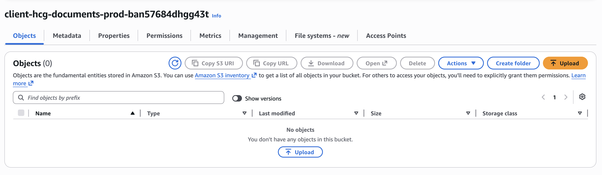
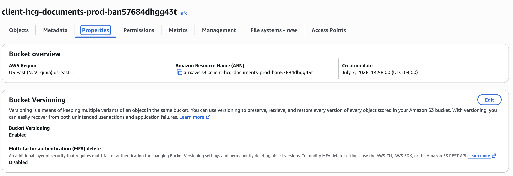
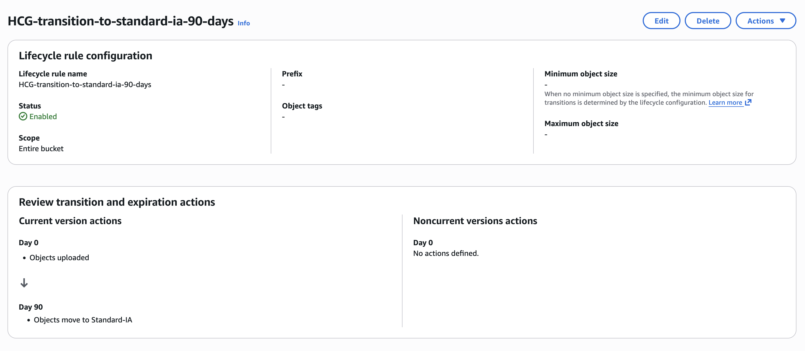
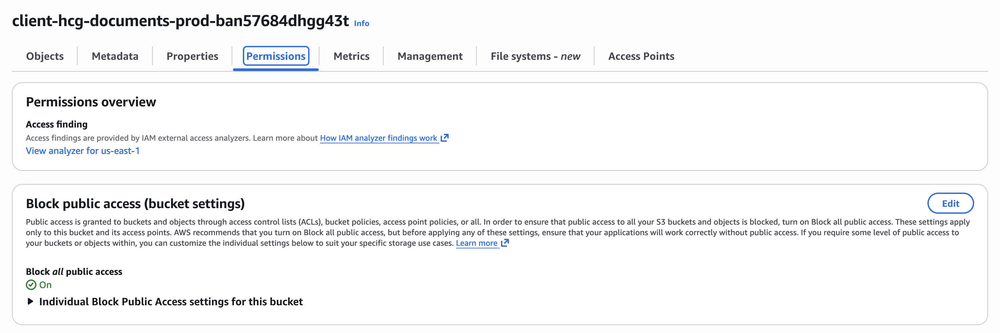
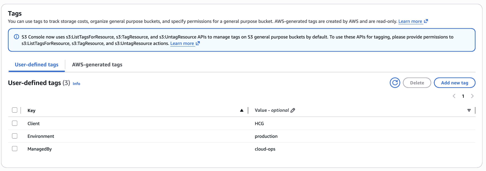

# Designing a Secure Cloud Document Storage Platform for Healthcare Group Corporation

## Business Problem

We provide cloud engineering and managed security services for organizations operating business-critical workloads on Amazon Web Services (AWS).

Healthcare Group Corporation (HCG) engaged us to design a secure cloud-based document storage solution for production business records. The organization required a storage platform that protected sensitive information, reduced long-term storage costs, and supported operational governance from deployment through ongoing management.

Our objective was to deliver a secure Amazon S3 storage solution that balanced data protection, operational efficiency, and cost optimization while establishing a repeatable deployment standard for future client environments.

## Business Requirements

Healthcare Group Corporation required a secure document storage platform that protected sensitive business records while remaining cost-effective throughout the data lifecycle. The solution also needed to support governance, operational consistency, and future growth without increasing administrative complexity.

The engagement required us to:

- Provision a dedicated production storage bucket for client documents.
- Protect all stored data by enabling Amazon S3 Block Public Access.
- Enable object versioning to improve recoverability from accidental changes or deletions.
- Automatically transition older documents to Amazon S3 Standard-IA after 90 days to reduce storage costs.
- Apply standardized resource tags to support ownership, governance, reporting, and cost allocation.

## Business Risks

Without appropriate security controls, sensitive healthcare documents could be exposed to unauthorized users, creating compliance, privacy, and reputational risks. Misconfigured storage settings or the absence of governance controls could also increase operational costs and complicate long-term management of client data.

The solution needed to protect confidential information while ensuring the storage platform remained scalable, recoverable, and financially sustainable throughout the document lifecycle.

## Proposed Solution

We designed a secure cloud storage solution that emphasized security, recoverability, governance, and cost optimization without increasing operational complexity. The solution established a standardized deployment model that could be reused across future client engagements while meeting Healthcare Group Corporation's production requirements.

Our solution included the following actions:

- Provisioned a dedicated Amazon S3 production bucket for healthcare documents.
- Enabled Amazon S3 Versioning to protect against accidental modification or deletion.
- Configured a lifecycle policy to automatically transition objects to Standard-IA after 90 days.
- Enabled all four Amazon S3 Block Public Access settings to prevent unintended public exposure.
- Applied standardized resource tags to support governance, ownership, automation, and cost allocation.

## Architecture Decisions

Every architectural decision supported four primary objectives: security, recoverability, governance, and cost optimization.

Key architectural decisions included:

- Using Amazon S3 Block Public Access as the default security control to eliminate the risk of unintended public exposure.
- Enabling Amazon S3 Versioning to improve data recoverability and protect against accidental modification or deletion.
- Implementing an automated lifecycle policy to transition infrequently accessed documents to Standard-IA after 90 days, reducing long-term storage costs without sacrificing availability.
- Applying standardized resource tags to support governance, ownership, automation, and cost allocation across the client's AWS environment.
- Establishing a repeatable deployment standard that can be consistently implemented for future client engagements.

## Implementation

We provisioned a dedicated Amazon S3 bucket using the client's production naming convention to establish an isolated storage location for Healthcare Group Corporation's business documents.

### Production S3 Bucket Created

The production bucket was created using a standardized naming convention, providing a dedicated storage location for the client's business records.

We then enabled Amazon S3 Versioning to improve data recoverability and protect against accidental modification or deletion of stored documents.

### Bucket Versioning Enabled

Versioning ensures previous object versions are preserved, improving recoverability and reducing the risk of permanent data loss.

Next, we configured an automated lifecycle rule to transition infrequently accessed documents to the Standard-IA storage class after 90 days.

### Lifecycle Rule Configured

The lifecycle rule automatically transitions older documents to Standard-IA, reducing long-term storage costs while maintaining immediate availability.

We enabled all four Amazon S3 Block Public Access settings to establish a secure default configuration and prevent unintended public exposure.

### Block Public Access Enabled

Enabling Block Public Access established a secure baseline and prevented accidental public exposure of sensitive business documents.

Finally, we applied standardized resource tags to identify client ownership, production environment, and operational responsibility.

### Resource Tags Applied

Standardized tags improve governance, simplify cost allocation, and support operational management across the AWS environment.

A final review confirmed that the storage platform satisfied the client's security, recoverability, governance, and cost optimization requirements.

### Final Bucket Configuration

The completed configuration verified that the bucket was securely deployed with versioning enabled, lifecycle management configured, Block Public Access enforced, and governance tags successfully applied.

## Verification

We verified that the Amazon S3 bucket was successfully provisioned using the approved production naming convention. Validation confirmed that Amazon S3 Versioning was enabled, the lifecycle rule transitioned objects to Standard-IA after 90 days, and all four Block Public Access settings were active.

We also confirmed that standardized resource tags were correctly applied for client ownership, production environment, and operational management. A final configuration review verified that the storage platform satisfied the client's security, governance, recoverability, and cost optimization requirements.

## Business Impact

By implementing a secure and standardized cloud storage platform, Healthcare Group Corporation gained a production-ready solution that protected sensitive business records while reducing long-term operational costs. The deployment strengthened the organization's security posture through preventive controls, improved data recoverability, and established governance practices that support future growth.

The engagement also delivered a repeatable deployment model that can be consistently applied across future client environments, reducing implementation time, improving operational consistency, and reinforcing cloud security best practices.

## Lessons Learned

### Lesson 1 — Secure by Default

Preventive security controls such as Amazon S3 Block Public Access should be enabled from the beginning of every deployment rather than added after a security issue is discovered.

### Lesson 2 — Automation Strengthens Governance

Versioning, lifecycle policies, and standardized resource tagging reduce manual administration while improving consistency, governance, and operational efficiency across cloud environments.

### Lesson 3 — Cloud Architecture Should Support Business Objectives

A well-designed storage platform is more than an Amazon S3 bucket. It protects sensitive information, improves recoverability, reduces long-term costs, and provides a scalable foundation that supports the client's business as it grows.

---

## Continue the Journey

This engagement is part of the **Designing Scalable Systems for Real People** portfolio, where SirhurryUp Corporation documents real-world cloud consulting engagements across security, infrastructure, automation, and scalable systems.

For the engineering narrative behind this engagement, read the accompanying Medium article.

Explore the remaining engagements to see how these principles evolve across AWS, Linux, Docker, Terraform, Kubernetes, Automation, and AI.

