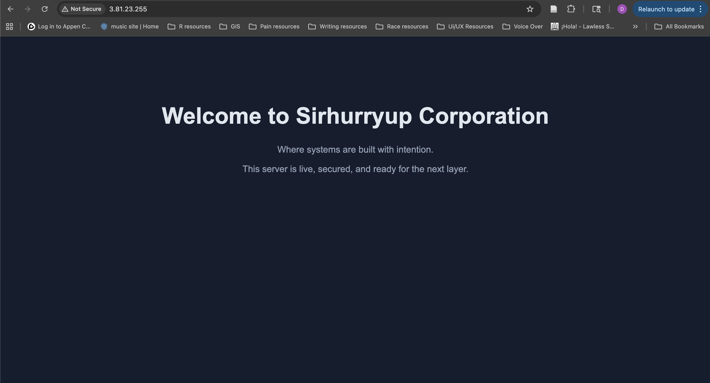
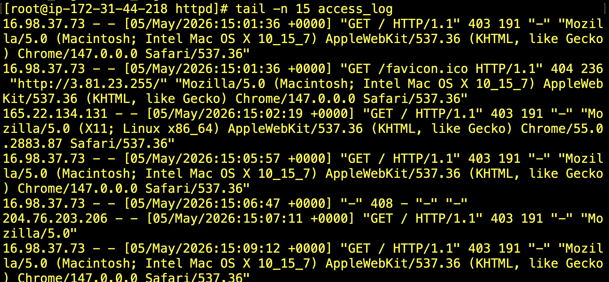
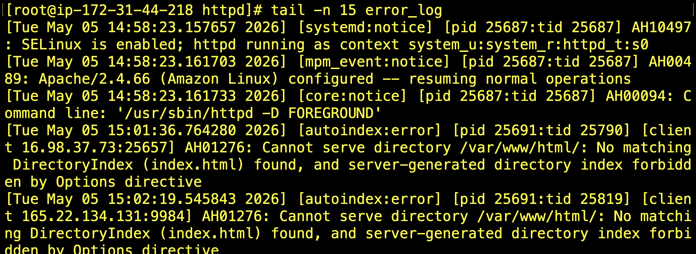
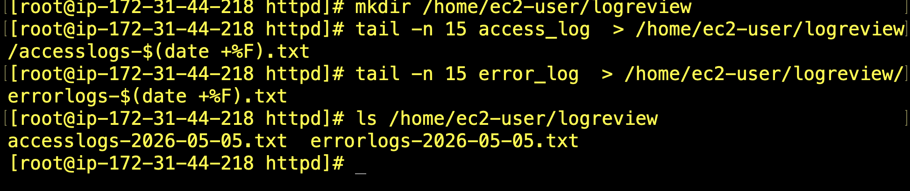

# Project 3: Bringing a Bank Online — Building and Observing a Web Server in the Cloud

## Company Context

Sirhurryup Corporation is preparing to launch its first customer-facing web presence. The goal is to provide a reliable and secure platform where users can access information and eventually interact with core services.

This project focuses on deploying a web server using Amazon Linux and Apache, validating public access, customizing the user experience, and observing system behavior through log analysis.

---

## Standing Up the System (Apache on EC2)

### Objective
Deploy a publicly accessible web server using Amazon Linux and Apache.

### What I Did


- Launched an EC2 instance using Amazon Linux
- Connected via SSH using key-based authentication
- Updated system packages
- Installed Apache (`httpd`)
- Started and enabled the Apache service
- Configured Security Group to allow HTTP (port 80)
- Verified server accessibility using public IPv4 address

### Commands Used

```bash
sudo yum update -y
sudo yum install httpd -y
sudo systemctl start httpd
sudo systemctl enable httpd
sudo systemctl status httpd
```

### Verification 

- Accessed the server via browser using public IP
- Confirmed Apache default page loaded successfully

### Key Observation 

The AWS console link timed out, but manually entering the public IPv4 address using HTTP successfullyreached the server . This reinforced the importance of understanding how network access is actually configured and tested. 

---

## Shaping the Experience (Custom HTML)


### Objective 
Control what users see when they access the web server. 

### What I Did

- Navigated to Apache document root
- Created a custom `index.html` page using `vim`
- Restarted Apache to apply changes
- Verifiec updateed content through browser

### Commands Used 

```bash
cd /var/www/html
sudo vim index.html
sudo systemctl restart httpd
```
### Result  


A custom landing page displyaing: 
Welcome to Sirhurryup Corporation 
Where systems are built with intention

## When Things Break (Log Analysis) 

### Objective 
Investigate system activity and identify potential issues using server logs. 

### What I Did 

- Accessed Apaache log directory
- Reviewed access and error logs
- Extracted recent log entries
- Exported logs into organized files for analysis

### Commands Used 




```bash
sudo su
cd /var/log/httpd
tail -n 15 access_log
tail -n 14 error_log

mkdir /home/ec2-user/logreview

tail -n 15 access_log > /home/ec2-user/logreview/accesslogs-$(date +%F).txt
tail -n 15 error_log > /home/ec2-user/logreview/error_log-$(date +%F).txt
```

### Output 


- Verifiec access logs captured browser requests
- Confirmed mininmal or no errors in error logs
- Created timestamped log files for review

### Key Insight 
Logs provide a direct view into systm behavior. Even when no errors are present, they confirm how users are interacting with the system and whether the server is functioning as expected.

---
## Why This Project Matters 
This project demonstractes more than just deploying a wweb server. 

It shows my ability to: 

- Bring infrastructure online
- Control the user-facing experience
- Investigate system behavior through logs
- Think beyond setup and into operations

Building systems is not just about making them work. 

It is about understanding how they behave once they are live.

--- 

