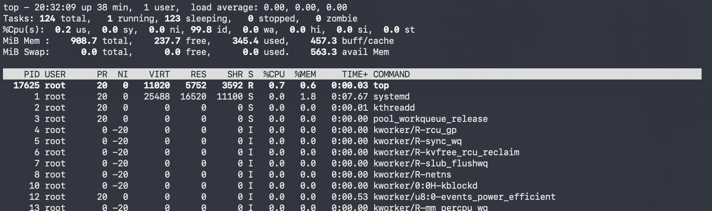

# Project 5: Evaluating Web Server Performance for Internal Services

## Company Context

Sirhurryup Corporation needed to select a web server for a lightweight internal service used by employees.

Several options were available, including Apache, NGINX, and Lighttpd. Rather than choosing a platform based on reputation or preference, the goal was to compare each server using a consistent test environment and objective measurements.

This project focused on evaluating response time and CPU utilization while serving the same web page across all three web servers.

The objective was simple:

Determine which solution provided the best balance of performance, efficiency, and operational practicality for a lightweight internal workload.

---

## Preparing the Test Environment

### Objective

Create a controlled environment where Apache, NGINX, and Lighttpd could be evaluated fairly.

### Environment

- Cloud Provider: AWS
- Operating System: Ubuntu
- Instance Type: EC2 Free Tier
- Testing Tools:
  - curl
  - time
  - top
- Test Page: Standard Sirhurryup Corporation HTML page

### What I Did

- Updated the Ubuntu server
- Installed Apache
- Installed NGINX
- Installed Lighttpd
- Created a standard HTML page
- Verified each server could successfully serve the same content

### Verification

Each web server successfully delivered the Sirhurryup Corporation test page through localhost and the browser.

---

## Comparing Web Server Response Times

### Objective

Measure how quickly each web server could respond to the same request while serving identical content.

### Test Method

Each server hosted the same Sirhurryup Corporation HTML page.

Response times were measured using:

time curl -s http://localhost > /dev/null

The goal was not to simulate heavy traffic, but rather to establish a baseline comparison under minimal load.

### Results

| Web Server | Response Time|
|------------|--------------|
| Apache     | 0.008s |
| NGINX      | 0.008s |
| Lighttpd   | 0.008s |

### Findings

All three web servers delivered identical response times during testing.

For a lightweight internal service, no meaningful performance difference was observed when measuring basic page delivery.

This result reinforced the importance of testing assumptions rather than relying solely on reputation or community opinions.

---

## Measuring System Impact

### Objective

Evaluate how much CPU each web server consumed while serving the same workload.

### Test Method

CPU utilization was observed using:

top

The goal was to identify whether any server required noticeably more system resources than the others while delivering identical content.

### Results

| Web Server | CPU Observation |
|------------|----------------|
| Apache | 0.7 |
| NGINX | 0.3 |
| Lighttpd | 0.3 |

### Findings

All three servers delivered identical response times, but Apache showed slightly higher CPU utilization during testing.

NGINX and Lighttpd demonstrated similar resource consumption and appeared more efficient under the conditions tested.

Although the difference was small, the results suggest that NGINX and Lighttpd may provide advantages when resource efficiency is a priority.

