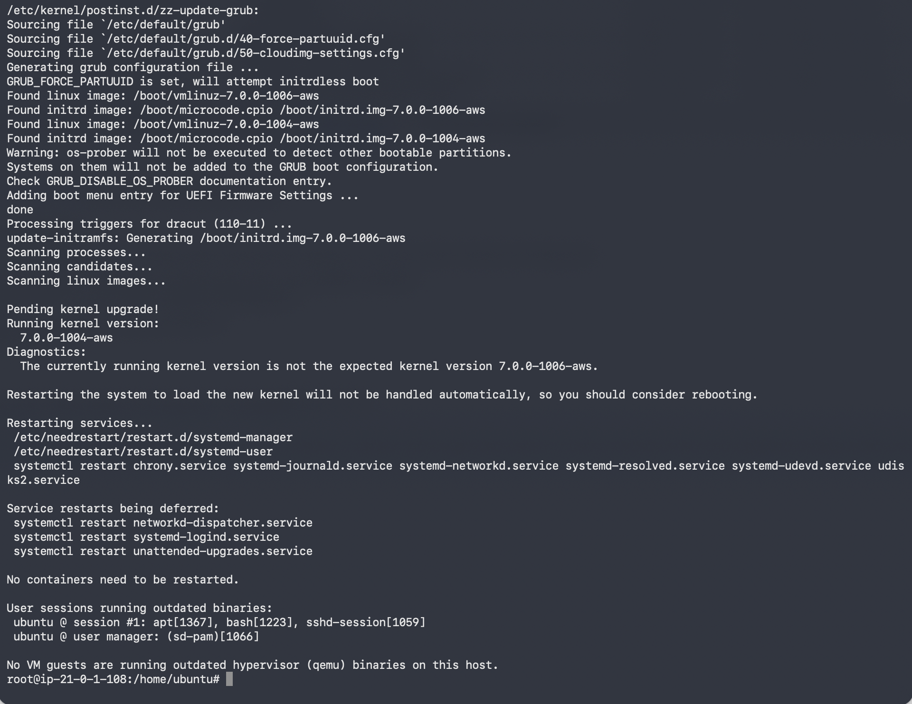
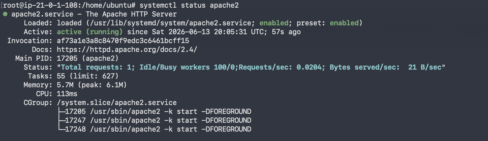
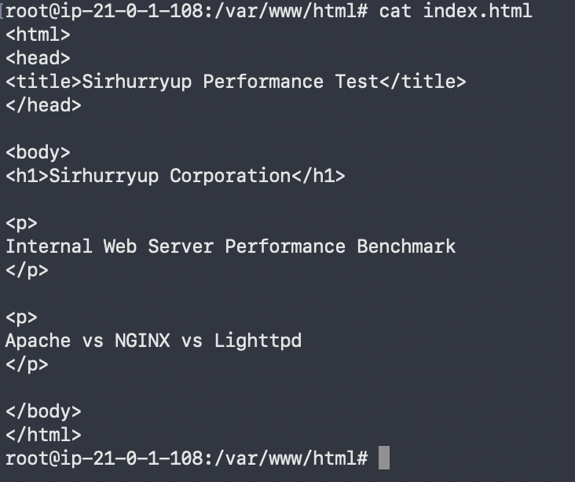
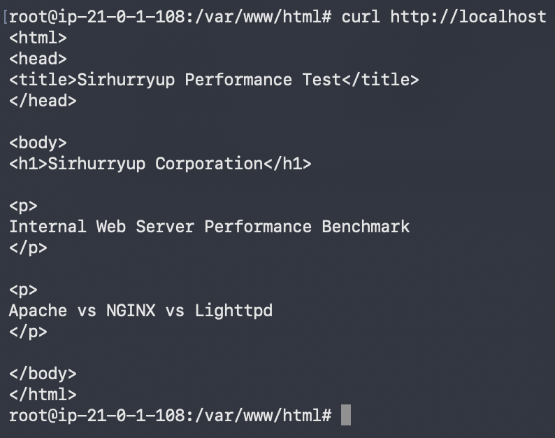
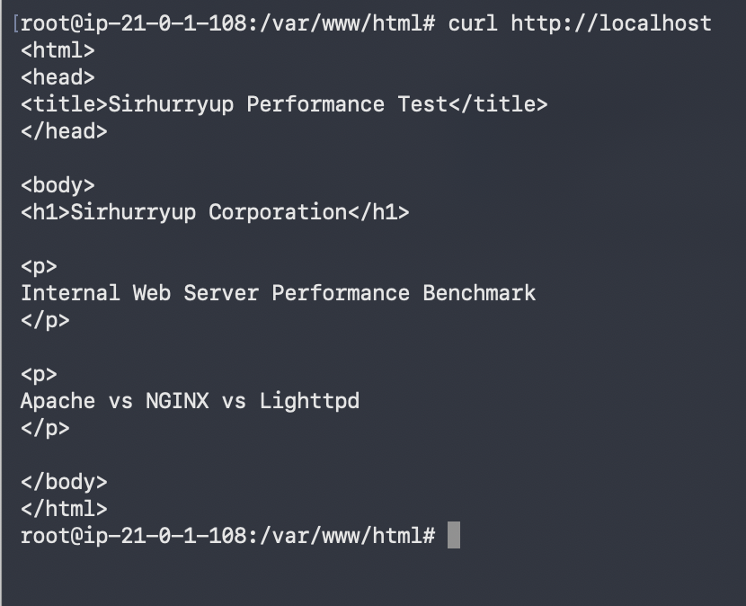
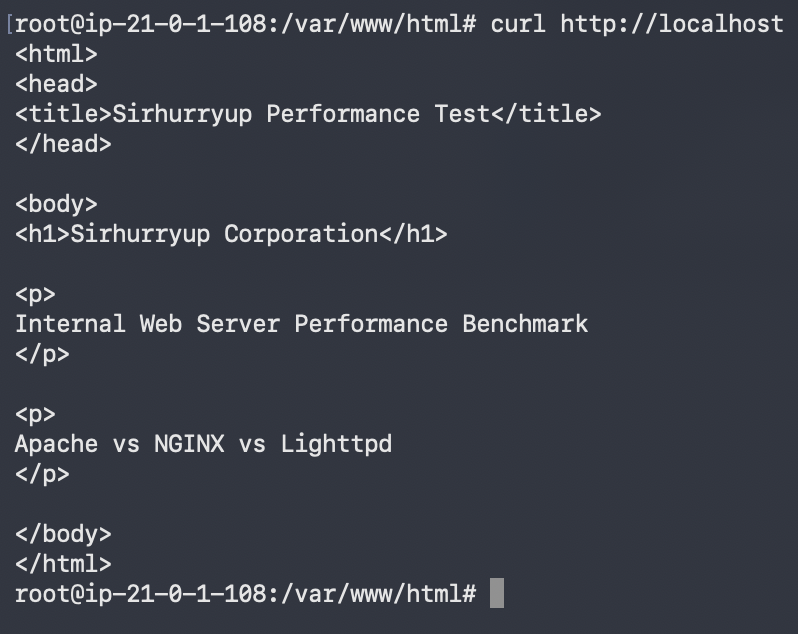

# Project 5: Evaluating Web Server Performance for Internal Services

## Company Context

Sirhurryup Corporation needed to select a web server for a lightweight internal service used by employees.

Several options were available, including Apache, NGINX, and Lighttpd. Rather than choosing a platform based on reputation or preference, the goal was to compare each server using a consistent test environment and objective measurements.

This project focused on evaluating response time and CPU utilization while serving the same web page across all three web servers.

The objective was simple:

Determine which solution provided the best balance of performance, efficiency, and operational practicality for a lightweight internal workload.

---

## Preparing the Test Environment

### Objective

Create a controlled environment where Apache, NGINX, and Lighttpd could be evaluated fairly.

### Environment

- Cloud Provider: AWS
- Operating System: Ubuntu
- Instance Type: EC2 Free Tier
- Testing Tools:
  - curl
  - time
  - top
- Test Page: Standard Sirhurryup Corporation HTML page

### What I Did

- Updated the Ubuntu server
- Installed Apache
- Installed NGINX
- Installed Lighttpd
- Created a standard HTML page
- Verified each server could successfully serve the same content

### Verification

Each web server successfully delivered the Sirhurryup Corporation test page through localhost and the browser.

